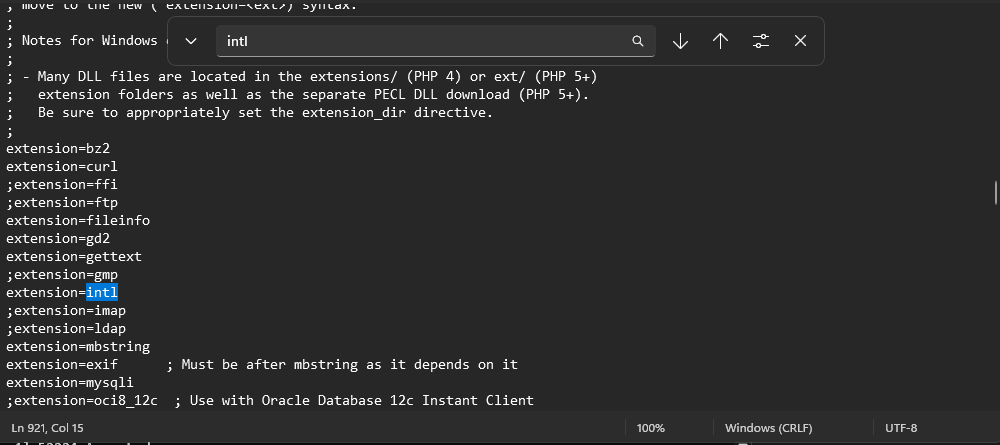
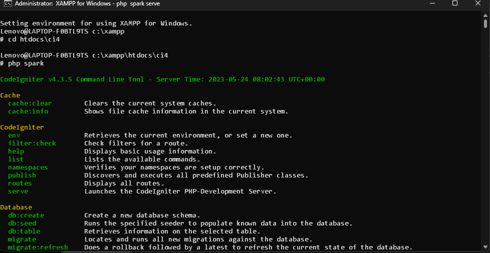

# Lab7Web

### Membuat PHP Frame Work (Codeigniter) <b>

### Berikut adalah langkah-langkah untuk membuat PHP Frame Work
1.  Mengaktifkan ekstensi dengan XAMPP Control Panel,  pada bagian Apache klik Config -> PHP.ini, dan akan muncul seperti gambar dibawah ini

> Pada bagian extention, hilangkan tanda ; (titik koma) pada ekstensi yang akan diaktifkan. Kemudian simpan kembali filenya dan restart Apache web server.

2. Start apache menjadi stop apache, lalu buka shell pada XAMPP ketik seperti gambar dibawah ini sesuai file yang dibuat.

> Apabila muncul output seperti dibawah ini, kita bisa langsung mengetik php spark serve <b><i> agar dapat mengakses codeigniter.

3. Setelah mengetik php spark serve <b><i>